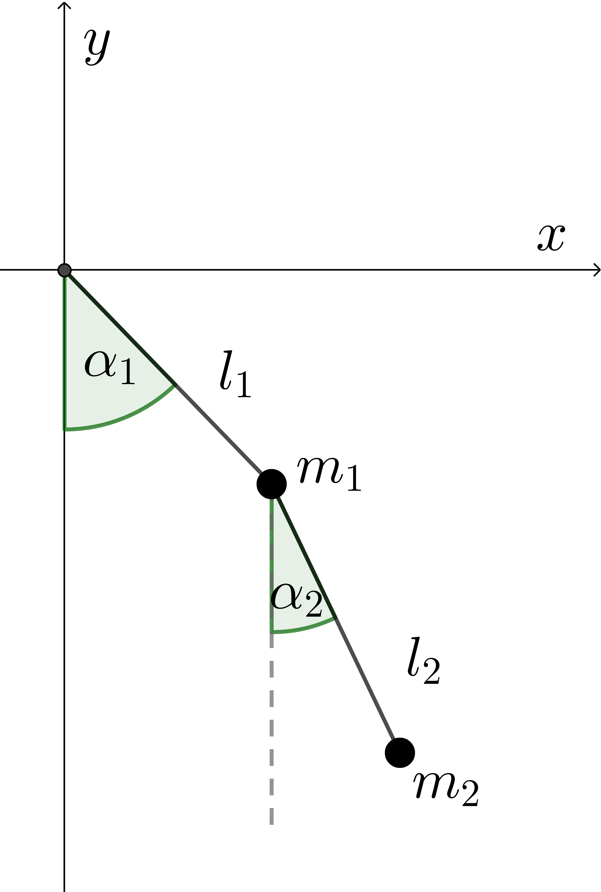
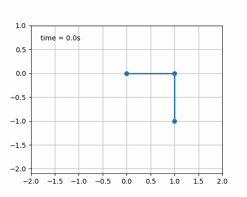
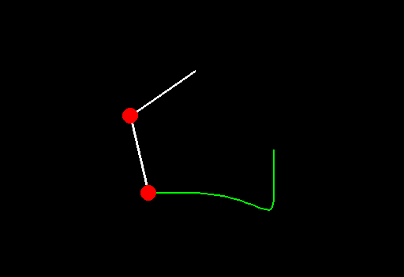
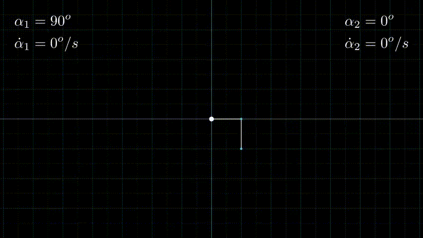

In Vorbereitung auf meine Doktorarbeit habe ich mich mit Mehrkörpermodellen auseinandergesetzt. 
Dabei habe ich mit Multipendeln, also Ketten von $$N \geq 2$$ Punktmassen $$m_1,\dots,m_N$$, die durch masselose Stäbe miteinander verbunden sind.

## Doppelpendel $$N=2$$

### Bewegungsgleichung

  

    
  
 

Wir betrachten ein Doppelpendel mit Punktmassen $$m_1$$, die durch einen Stab der Länge $$l_1$$ mit dem Koordinatenursprung verbunden ist, und $$m_2$$, die durch einen Stab der Länge $$l_2$$ an $$m_1$$ befestigt ist.
Den Zustand eines Doppelpendels für einen Zeitpunkt $$t$$ ist eindeutig mittels der Winkel $$\alpha_1$$ und $$\alpha_2$$ bestimmt. 
Fasst man diese beiden Winkel in einem Vektor $$q:=(\alpha_1,\alpha_2)^\top$$ zusammen, so kann man die Bewegung des Doppelpendels in Abhängigkeit des Vektors $$q$$ bzw. dessen Ableitungen nach der Zeit darstellen.
Die Herleitung erfolgt mit den sogenannten *Euler-Lagrange-Gleichungen*
$$\frac{\mathrm{d}}{\mathrm{d}t}\left(\frac{\partial L}{\partial \dot{q}_k}(q,\dot{q})\right)-\frac{\partial L}{\partial q_k}(q), \qquad (k=1,2).$$
Hier bezeichne $$L(q,\dot{q}):=T(q,\dot{q})-U(q)$$
die Lagrange-Funktion, die als Differenz aus kinetischer Energie $$T(q,\dot{q})$$ und potenzieller Energie $$U(q)$$ definiert ist.
Die Punkte über den Variablen kennzeichnen dabei stets Ableitungen nach der Zeit.
Geht man davon aus, dass $$m_1=m_2=:m$$ und $$l_1=l_2=:l$$ ist, so kann man kinetische und potenzielle Energie schreiben als

$$T(q,\dot{q})=\frac{ml^2}{2}\left(2\dot{\alpha}_1^2+2\cos(\alpha_2-\alpha_1)\dot{\alpha}_1\dot{\alpha}_2+\dot{\alpha}_2^2\right)$$

und 

$$U(q)=-mgl(2\cos(\alpha_1)+\cos(\alpha_2)),$$

wobei $$g=9.81\frac{m}{s^2}$$ die Fallbeschleunigung ist.

Setzt man dies in die Euler-Lagrange-Gleichungen ein, so erhält man die Bewegungsgleichungen

$$\left( \begin{array}{cc}
2 & \cos(\alpha_2-\alpha_1)  \\ 
\cos(\alpha_2-\alpha_1)  & 1  \\
\end{array}\right)
\left( \begin{array}{c}
\ddot{\alpha}_1   \\ 
\ddot{\alpha}_2   \\
\end{array}\right)
=\left( \begin{array}{c}
-2\frac{g}{l}\sin(\alpha_1)+\sin(\alpha_2-\alpha_1)\dot{\alpha}_2^2   \\ 
-\frac{g}{l}\sin(\alpha_2)-\sin(\alpha_2-\alpha_1)\dot{\alpha}_1^2   \\
\end{array}\right).$$

Dies ist ein lineares Differentialgleichungssystem 2. Ordnung in impliziter Darstellung.

Um dieses Differentialgleichungssystem mit einem Runge-Kutta-Verfahren numerisch lösen zu können, muss man es in ein äquivalentes System erster Ordnung transformieren.
Setze dazu $$z:=\left( \begin{array}{c}
q   \\ 
\dot{q}  \\
\end{array}\right)
=\left( \begin{array}{c}
\alpha_1 \\
\dot{\alpha_1}  \\ 
\alpha_2   \\
\dot{\alpha_2}
\end{array}\right).$$
Dann ist 
$$\left( \begin{array}{cccc}
1&0&0&0\\
0&2&0 & \cos(z_3-z_1)  \\ 
0&0&1&0\\
0&\cos(z_3-z_1) &0 & 1  \\
\end{array}\right)
\dot{z}
=\left( \begin{array}{c}
z_2\\
-2\frac{g}{l}\sin(z_1)+\sin(z_3-z_1)z_4^2   \\ 
z_4\\
-\frac{g}{l}\sin(z_3)-\sin(z_3-z_1)z_2^2   \\
\end{array}\right).$$

ein dazu äquivalentes System erster Ordnung der Form $$Mz=f(z)$$. Hierbei bezeichnet man f(z) als rechte Seite.

Zusammen mit Anfangsbedingungen $$ z(t_0) = z_0 \in \mathbb{R}^4$$ ergibt sich ein Anfangswertproblem,
das z.B. mit einem Runge-Kutta-Verfahren gelöst werden kann (die Lösung ist dabei $$z$$). 

### Animationen des Doppelpendels

Für die Anfangsbedingung

$$ z(t_0) = z(0)= z_0 := (\frac{\pi}{2},0,0,0)^\top,$$
den Massen $$m_1=m_2=1$$ und den Stablängen $$l_1=l_2=1$$
kann das zugehörige Anfangswertproblem durch das explizite Runge-Kutta-Verfahren der Ordnung 4(5) mit dem Befehl `scipy.integrate.solve_ivp` (siehe [Link](https://docs.scipy.org/doc/scipy/reference/generated/scipy.integrate.solve_ivp.html))
gelöst werden. Die Bewegung des Doppelpendels lässt sich dann mittels verschiedener Engines animieren:

1. mittels `Matplotlib`

[Link zum Projekt](https://github.com/antonia-kaufmann/double_pendulum_matplotlib)

2. mittels `Pygame`

[Link zum Projekt](https://github.com/antonia-kaufmann/double_pendulum_pygame)

3. mittels der Animations-Engine `Manim` vom YouTuber [3Blue1Brown](https://www.3blue1brown.com/)

Mittels `Manim` werden allgemein Videos kreiert. Beispielsweise kann man damit Mathematik-Erklärvideos produzieren.

[Link zum Projekt](https://github.com/antonia-kaufmann/double_pendulum_manim)

